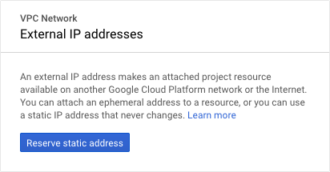

# WireGuard Server: Google Cloud Platform

In this tutorial, we setup a WireGuard service in Google Cloud Platform.
Open a [Google Cloud Platform account](https://cloud.google.com/), which is free.

At the end of this tutorial, a new Compute Engine VM will have a virtual network interface `wg0`
living on private network `/`.
The Compute Engine VM will be ready to [add WireGuard clients](/client).

## Platform

In this section, we'll use the [GCP web console](https://console.cloud.google.com/).

Create a new project just for WireGuard.
In this example, the project name is `my-wireguard-project`.

For subsequent steps, you'll need to decide which region your WireGuard service will live in.
In this example, `us-west1 (Oregon)` is chosen because it happens to be geographically close.

### Open a Port

The new project comes pre-configured with a VPC network named `default`,
and firewall rules that block inbound packets to all but a few ports.
WireGuard uses UDP, and is commonly configured to listen on port .

Navigate to [VPC network > Firewall rules](https://console.cloud.google.com/networking/firewalls).

Click "Create Firewall Rule" near the top of the page.





- Give the rule a name. Here, I'm using `wireguard`.
- This is an ingress rule on the default network.
- Targets include "All instances in the network".
- Source filter is "IP ranges", specifically `0.0.0.0/0`.
- Under "Protocols and ports", select "Specified protocols and ports".
- Check "udp" and enter .
- Click "Create".





### Create a Static IP Address

We'll need to reserve a static IP address so that our clients know where to find the service.

Navigate to [VPC network > External IP addresses](https://console.cloud.google.com/networking/addresses).

Click "Reserve Static Address" in the dialog
(or near the top of the page if you already have an address or two here).





- Give the IP address a name. Here, I'm using `marge`.
- Use the premium network service tier, but be aware that [two network tiers exist](https://cloud.google.com/network-tiers/) and this might matter depending on your reason for using a VPN.
- We'll use IPv4 and "regional" type.
- Select the region where you intend to run the WireGuard service.
- Click "Reserve".





### Create a VM Instance

The VM instance is the virtual machine where our WireGuard service will run.

Navigate to [Compute Engine > VM instances](https://console.cloud.google.com/compute/instances).

Click "Create" in the dialog
(or click "Create Instance" near the top of the page if you already have an instance or two here).





- Give the VM instance a name. Here, I'm using `marge`.
- Select the region where you intend to run the WireGuard service. The zone selection doesn't matter.
- The machine type drives the price you'll pay each month. In this example, I've selected family "General-purpose", Series "N1", Machine type "f1-micro" because [the first 744 hours are free every month](https://cloud.google.com/free/docs/gcp-free-tier#always-free), and because [the performance is good enough](TODO).
- Boot disk is how we select an operating system. In this example, I've selected "Debian GNU/Linux 10 (buster)".
- Assign the reserved static IP address.
  - Click "Management, security, disks, networking, sole tenancy".
  - Click "Networking".
  - Click the "default" network interface.
    
  - Under "External IP" select the static IP address created in the previous section.
  - Click "Done" in the network interface section
- Click "Create" at the bottom of the page.





Watch for the green check mark indicating that the new VM instance has initialized.

### Shell

In this section, we'll use the shell on our VM instance to install and configure WireGuard.

Open a terminal on the new VM instance.
Under the "Connect" column, click "SSH", or use the `gcloud` command via your local machine's console.





## Setup WireGuard

### Install WireGuard



Also install linux-headers-VERSION, as it seems the
[Debian WireGuard packages don't declare that dependency, or it's just broken in GCP](https://stackoverflow.com/questions/37570910/rtnetlink-answers-operation-not-supported).

```text
$ sudo apt install linux-headers-$(uname -r)
Reading package lists... Done
Building dependency tree       
Reading state information... Done
The following NEW packages will be installed:
...
Fetched 556 kB in 0s (7381 kB/s)                       
Selecting previously unselected package linux-headers-4.19.0-6-cloud-amd64.
(Reading database ... 60668 files and directories currently installed.)
Preparing to unpack .../linux-headers-4.19.0-6-cloud-amd64_4.19.67-2+deb10u2_amd64.deb ...
Unpacking linux-headers-4.19.0-6-cloud-amd64 (4.19.67-2+deb10u2) ...
Setting up linux-headers-4.19.0-6-cloud-amd64 (4.19.67-2+deb10u2) ...
```

### Create Keys



### Create the WireGuard Network Device


