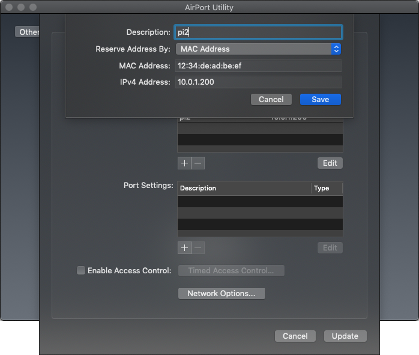
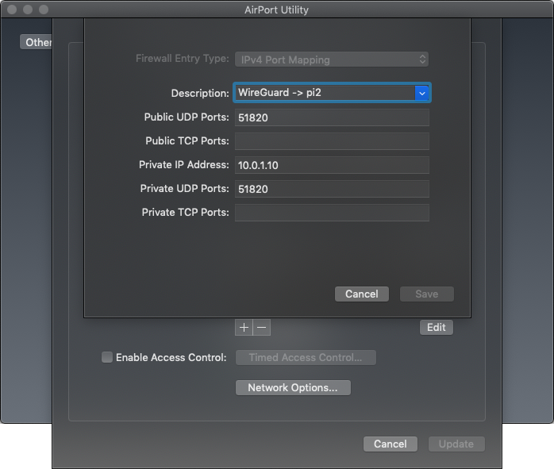

# WireGuard Server: Raspbian Buster

In this tutorial, we setup a WireGuard server on a Raspberry Pi running [Raspbian Buster](https://www.raspbian.org/)
(which is 99% [Debian Buster](/server/debian)).

At the end of this tutorial, the device will have a virtual network interface `wg0`
living on private network `/`.
The device will be ready to [add WireGuard clients](/client).

## Platform

In this example, I'm using a Raspberry Pi 2 Model B v1.1.
This will not work on Raspberry Pi versions prior to 2.

- Follow the [installation instructions](https://www.raspberrypi.org/documentation/installation/installing-images/README.md)
- Set a non-default password for user `pi` with `passwd` or `sudo raspi-config`
- Update the base install with `sudo apt update && sudo apt upgrade`

### Configure the Local Area Network

Ensure that UDP port `` on the Raspberry Pi is available to the public internet via a stable IP address.

In this example, the device is connected to a local area network behind a WiFi/NAT router.
The NAT router has public, static IP address ``,
and acts as default gateway for local area network `` as ``.
The NAT router is configured to always assign ``
to the Raspberry Pi device via DHCP reservation.

TODO take new screenshots




The NAT router is configured to forward incoming network traffic to UDP port `` to the Raspberry Pi device.

TODO take new screenshots




### Shell

For the the rest of this tutorial, we'll interact with Raspbian via command line interface.
Open a terminal as an unprivileged user via the console, the Terminal GUI app, or SSH.

### Trust Debian

By default, Raspbian doesn't trust the Debian package repository.
Add Debian's public keys to the trusted set of keys.

```text
$ sudo apt-key adv --keyserver hkp://p80.pool.sks-keyservers.net:80 --recv-keys 04EE7237B7D453EC 648ACFD622F3D138
Executing: /tmp/apt-key-gpghome.p9XKvbbATY/gpg.1.sh --keyserver hkp://pool.sks-keyservers.net:80 --recv-keys 04EE7237B7D453EC 648ACFD622F3D138
gpg: key DC30D7C23CBBABEE: public key "Debian Archive Automatic Signing Key (10/buster) <ftpmaster@debian.org>" imported
gpg: key E0B11894F66AEC98: public key "Debian Archive Automatic Signing Key (9/stretch) <ftpmaster@debian.org>" imported
gpg: Total number processed: 2
gpg:               imported: 2
```

## Setup WireGuard

### Install WireGuard



### Create Keys



### Create the WireGuard Network Device


